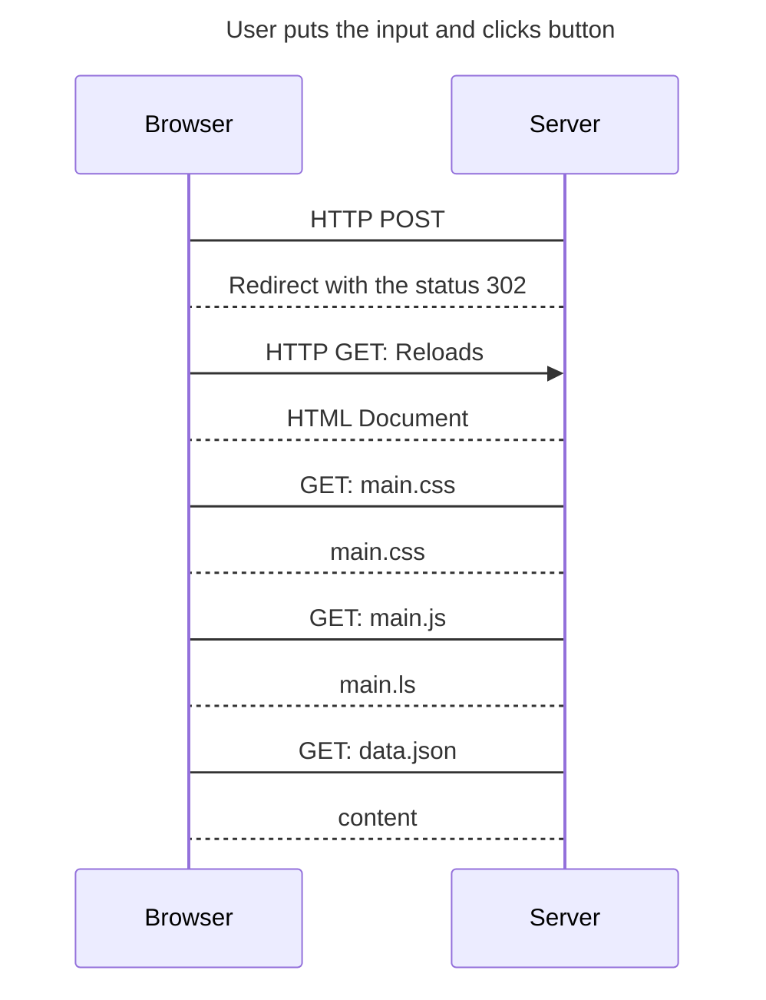

After a user puts the input and clicks button 

## Sample sequence diagram

```mermaid
sequenceDiagram;
Title: User puts the input and clicks button 

Browser->Server: HTTP POST
Server-->Browser: Redirect with the status 302
Browser->>Server: HTTP GET: Reloads
Server-->Browser: HTML Document
Browser->Server: GET: main.css
Server-->Browser: main.css
Browser->Server: GET: main.js
Server-->Browser: main.ls
Browser->Server: GET: data.json
Server-->Browser: content

```
