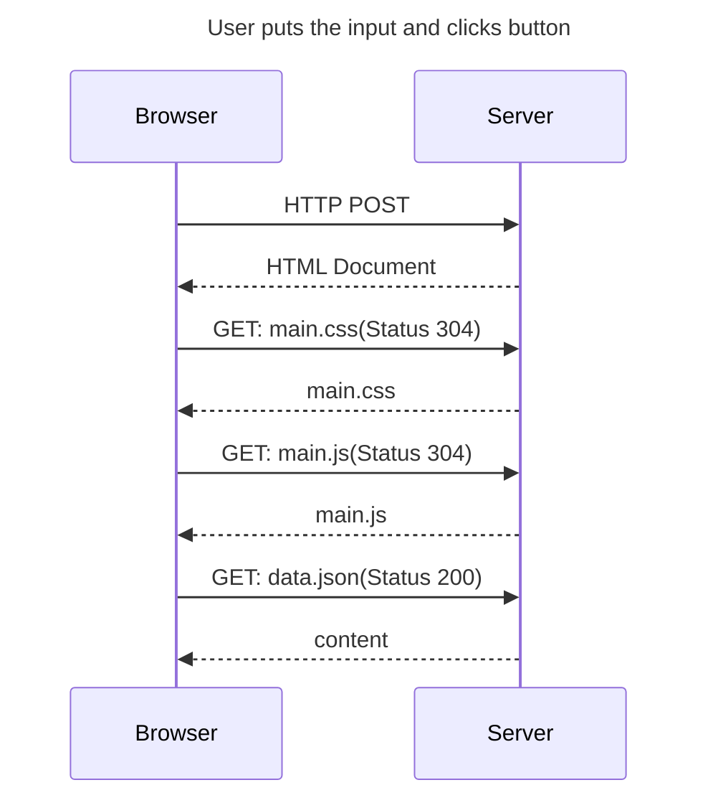

After a user puts the input and clicks button 

## SPA sequence diagram

```mermaid
sequenceDiagram;
Title: User puts the input and clicks button 

Browser->>Server: HTTP POST
Server-->>Browser:HTML Document
Browser->>Server: GET: main.css(Status 304)
Server-->>Browser: main.css
Browser->>Server: GET: main.js(Status 304)
Server-->>Browser: main.js
Browser->>Server: GET: data.json(Status 200)
Server-->>Browser: content
```
